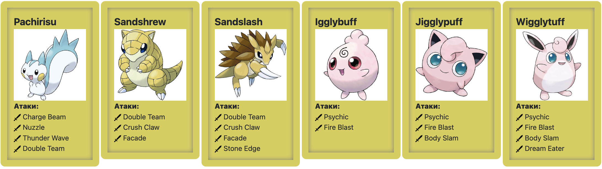

# Лабораторная работа №2 | Вариант №3874

## Содержание

1. [Задание](#задание)
2. [Требования к программе](#требования-к-программе)
3. [Примечания](#примечания)
4. [Вариант 3874 — список покемонов и атак](#вариант-3874)
5. [Отчёт по лабораторной работе](#отчёт-по-лабораторной-работе)
6. [Вопросы к защите](#вопросы-к-защите)

---

## Задание

На основе базового класса `Pokemon` написать собственные классы для заданных видов покемонов и реализовать набор атак на основе классов `PhysicalMove`, `SpecialMove` и `StatusMove`. Классы покемонов должны наследовать друг друга в соответствии с цепочками эволюции. Для всех реализованных атак задать тип, силу и точность и, при необходимости, переопределить поведение. Создать симуляцию боя `Battle`, собрать две команды по варианту и запустить поединок.

Подробнее — см. документацию Javadoc в поставляемом `Pokemon.jar`.

---

## Требования к программе

* Использовать предоставленный `Pokemon.jar` при компиляции и запуске (распаковывать JAR не нужно).
* Для каждого вида покемона задать один или два типа и базовые характеристики: HP, attack, defense, special attack, special defense, speed.
* Реализовать все перечисленные в варианте атаки. Для стандартных эффектов можно использовать встроенные механики; для нестандартных — переопределять соответствующие методы (см. Javadoc).
* Классы, которые не должны иметь наследников, объявить финальными (или реализовать соответствующим образом, чтобы от них нельзя было наследоваться).
* Для каждого покемона назначить минимальный уровень, необходимый для использования всех реализованных атак.
* Собрать две команды (каждому покемону назначить имя) и запустить `Battle`.
* Результат работы включить в отчёт и приложить исходный код и диаграмму классов.

---

## Комментарии

Цель работы: на простом примере разобраться с основными концепциями ООП и научиться использовать их в программах.

Что надо сделать (краткое описание)

* Ознакомиться с [документацией](https://se.ifmo.ru/~tony/doc/), обращая особое внимание на классы ```Pokemon``` и ```Move```. При дальнейшем выполнении лабораторной работы читать документацию еще несколько раз.
* Скачать файл Pokemon.jar. Его необходимо будет использовать как для компиляции, так и для запуска программы. Распаковывать его не надо! Нужно научиться подключать внешние jar-файлы к своей программе.
* Написать минимально работающую программу и посмотреть как она работает.
```
Battle b = new Battle();
Pokemon p1 = new Pokemon("Чужой", 1);
Pokemon p2 = new Pokemon("Хищник", 1);
b.addAlly(p1);
b.addFoe(p2);
b.go();
```
* Создать один из классов покемонов для своего варианта. Класс должен наследоваться от базового класса ```Pokemon```. В конструкторе нужно будет задать типы покемона и его базовые характеристики. После этого попробуйте добавить покемона в сражение.
Создать один из классов атак для своего варианта (лучше всего начать с физической или специальной атаки). Класс должен наследоваться от класса ```PhysicalMove``` или ```SpecialMove```. В конструкторе нужно будет задать тип атаки, ее силу и точность. После этого добавить атаку покемону и проверить ее действие в сражении. Не забудьте переопределить метод ```describe```, чтобы выводилось нужное сообщение.
* Если действие атаки отличается от стандартного, например, покемон не промахивается, либо атакующий покемон также получает повреждение, то в классе атаки нужно дополнительно переопределить соответствующие методы (см. документацию). При реализации атак, которые меняют статус покемона (наследники ```StatusMove```), скорее всего придется разобраться с классом ```Effect```. Он позволяет на один или несколько ходов изменить состояние покемона или модификатор его базовых характеристик.
* Доделать все необходимые атаки и всех покемонов, распределить покемонов по командам, запустить сражение.


---

## Вариант 3874

**Ваши покемоны:**



---

## Отчёт по лабораторной работе

Отчёт должен содержать:

* Текст задания (копия формулировки).
* Диаграмму классов реализованной объектной модели (UML). Покажите наследование покемонов и атак, а также используемые поля и ключевые методы.
* Исходный код (все `.java` файлы).
* Скриншоты или текст вывода программы — результат работы симуляции боя.
* Выводы по работе — что сделано, с какими проблемами столкнулись и как решили.


---

## Вопросы к защите

1. Объектно-ориентированное программирование. Основные понятия: объекты, наследование, полиморфизм, инкапсуляция.
2. Понятие класса. Классы и объекты в Java.
3. Члены класса. Поля, методы, конструкторы. Модификаторы доступа.
4. Создание и инициализация объектов. Вызов методов.
5. Области видимости переменных.
6. Модификаторы `final` и `static`.
7. Пакеты, инструкция `import`.
